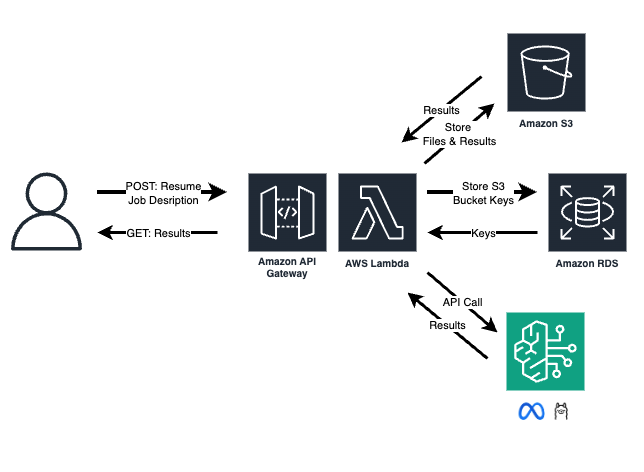

# Resume Hero 
### An AI-Powered Resume Analysis App on AWS



This project is a **Streamlit web application** that allows users to **upload resumes & job descriptions** in PDF format, process them using AI, and receive **skills analysis, resume improvement advice, and a generated cover letter**.

The application can be run **locally** or **inside a Docker container**.

## Prerequisites

Ensure you have the following installed before proceeding:

- **Python 3.9+** (For local setup)
- **pip** (Python package manager)
- **Docker** (For running the app in a container)
- **Git** (For cloning the repository)


## Server Side Setup

- Set up the a mysql database server with **AWS RDS** and set up table with `create-resumeapp.sql`
- Set up new identity name "S3readwrite" and assign proper authorization to read and write files in S3
- Have model access within **AWS Bedrock** and add proper authorization to "S3readwrite" to access the service
- Create 3 seperate **AWS Lambda** functions using the 3 lambda files provided, make sure:
    - copy the datatier.py and resumeapp-config.ini to the function directory
    - fill in the required blocks in the config file
    - set up execution time (2 mins minimum) and add layers properly
- Create new api gateway using the lambda functions (and name them as described in project description)
- Finally, modify the configuration files and endpoints in `client/app.py`

## Running the App Locally

Navigate to the project root directory and do:
```sh
streamlit run app.py
```
A webpage will be loaded in the default browswer

## Running the App Inside Docker

Navigate to the project root directory and do:
```sh
docker build -t streamlit-app .
docker run -p 8501:8501 streamlit-app
```
A webpage will be loaded in the default browswer

## Uploading PDFs & Retrieving Results

- Upload a Resume and Job Description – The app will process the PDFs using AI and generate analysis.
- Retrieve Results by Job ID – If you've already uploaded a resume, you can enter the Job ID to fetch results.

## Future Improvements

- User login with password
- PDF upload validation
- Results download as PDF

**Credit:** The idea and code for this project were partially adapted from CS310 (2025 Winter) taught by [Professor Joseph Hummel](https://www.mccormick.northwestern.edu/research-faculty/directory/profiles/hummel-joseph.html) at Northwestern University.